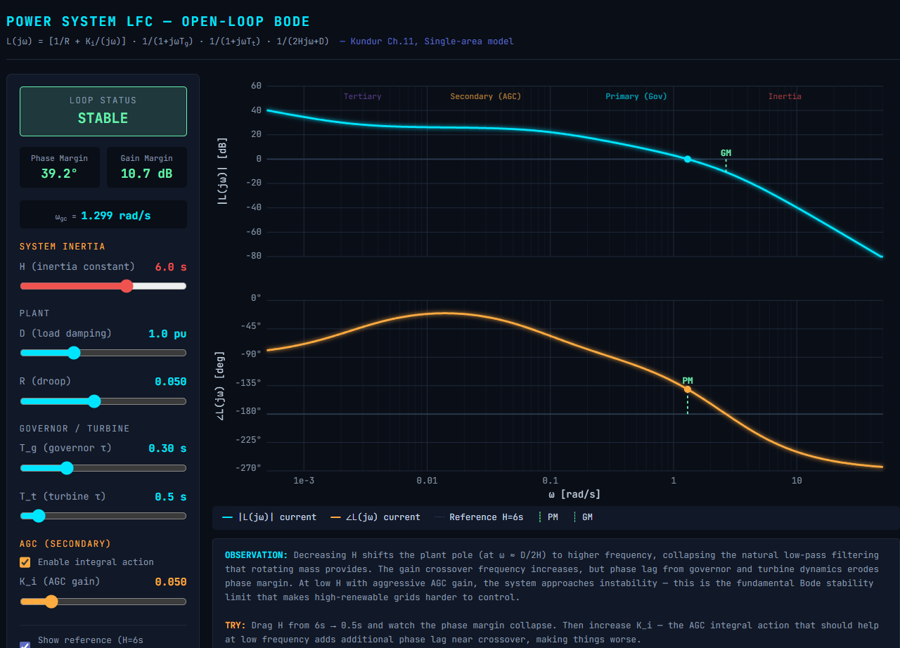
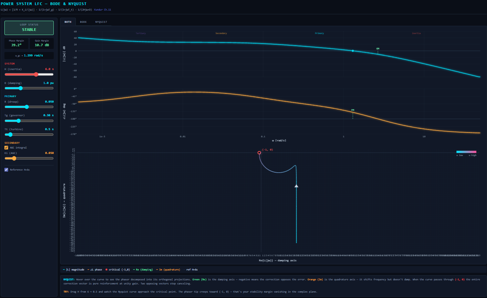
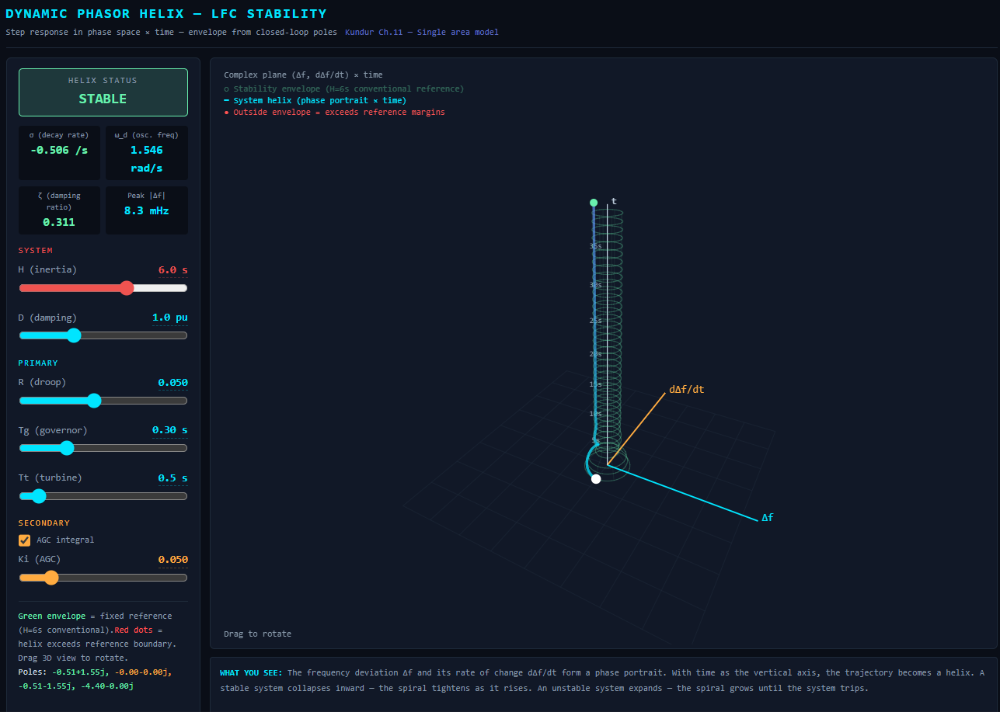
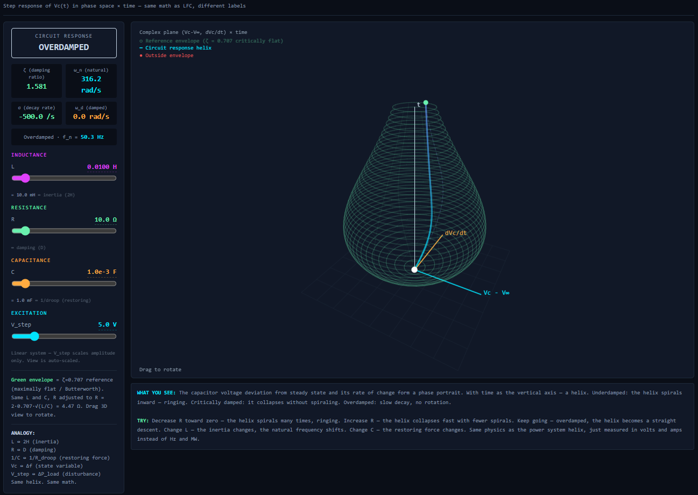

# Dynamic Impedance Phasor Helix

**A 3D visualization of control-system dynamics: the closed-loop step response drawn as a helix in phase space × time, set against its frequency-domain counterpart, the Bode and Nyquist plots of the open loop.**

*Sanjin Redzic B.Sc.*  
*Bergen, Norway — March 2026*

[](https://ninjas1337.github.io/Dynamic-Impedance-Phasor-Helix/)
[](https://doi.org/10.5281/zenodo.19321817)
[](LICENSE)

> **Status: work in progress.** The tools run, and the mathematics inside each one is standard and checked. The conceptual framing — what exactly the time-domain helix and the frequency-domain plots are to each other — is still being worked out. This README states the current understanding, including a correction to an earlier claim, rather than a finished result.

---

## Live Demo

**[Open the interactive models →](https://ninjas1337.github.io/Dynamic-Impedance-Phasor-Helix/)**

All models run directly in the browser. Nothing to install, no build step, no React environment required. Drag the helices to rotate them; move the sliders to re-solve the system in real time.

| Model | Direct link |
|-------|-------------|
| **All three, one page** | [Dynamic-Impedance-Phasor-Helix](https://ninjas1337.github.io/Dynamic-Impedance-Phasor-Helix/) |
| LFC Helix | [lfc-helix.html](https://ninjas1337.github.io/Dynamic-Impedance-Phasor-Helix/lfc-helix.html) |
| RLC Helix | [rlc-helix.html](https://ninjas1337.github.io/Dynamic-Impedance-Phasor-Helix/rlc-helix.html) |
| Bode & Nyquist | [bode-nyquist.html](https://ninjas1337.github.io/Dynamic-Impedance-Phasor-Helix/bode-nyquist.html) |

---

## Preview

### Traditional Bode for a Grid


### Bode & Nyquist


### LFC Dynamic Phasor Helix (NEW)


### RLC Circuit Helix (NEW)


---

## Motivation

The classical tools for analyzing feedback stability — Bode plots (1930s) and Nyquist plots (1940s) — are two-dimensional pictures of one complex function, the open-loop frequency response L(jω). The Bode plot decomposes it into magnitude and phase, each plotted against frequency. The Nyquist plot traces its tip through the complex plane with frequency as the parameter. Neither of them shows time. The step response shows time and nothing else. Each picture discards something the others keep.

This project builds the **Dynamic Phasor Helix**: the closed-loop phase portrait (state variable against its own time derivative) extruded along a time axis, forming a three-dimensional spiral. The helix encodes instantaneous amplitude (radius), instantaneous phase (rotation), damping (taper), and temporal evolution simultaneously. A **reference envelope**, derived from a benchmark system's decay profile, gives a geometric comparison: a system that recovers at least as well as the benchmark stays inside the funnel.

The human visual system processes three-dimensional spatial relationships natively. A spiral collapsing inside a funnel communicates recovery without cross-referencing two separate 2D graphs. The project began as an attempt to understand Bode and Nyquist by finding the geometry underneath them, and the most useful thing it has produced so far is the distinction in the next section.

## Two Helices, and What Projects onto What

An earlier version of this README claimed that the Bode plot, the Nyquist plot and the step response are all projections of the time-domain helix. That claim is withdrawn. Two of the three cannot be projections of it, and seeing why is the point.

There are two distinct three-dimensional curves involved, living in different spaces.

**The time-domain helix** — what `lfc-helix.html` and `rlc-helix.html` draw — lives in (x, ẋ/ω_d, t). It is the closed-loop response to a step input. Its literal projections are:

- **Viewed down the time axis:** the phase portrait, a logarithmic spiral.
- **Viewed from the side:** the step response and its decay envelope.
- **Read in cylindrical coordinates at each height:** the instantaneous amplitude r(t) and instantaneous phase θ(t) of the response — the analytic-signal envelope and phase for a narrowband mode [10].

For a single complex pole pair s = σ ± jω_d, the helix *is* the pole: it is e^{st} traced in (Re, Im, t). The decay rate σ sets the taper; ω_d sets the pitch. The s-plane, usually drawn as a flat map of points, is a catalogue of such helices.

**The frequency-domain helix** lives in (ω, Re L(jω), Im L(jω)): the open-loop frequency response as a space curve. Its literal projections are:

- **Viewed down the ω axis:** the Nyquist plot.
- **In cylindrical coordinates against ω:** the Bode magnitude plot and the Bode phase plot.
- **Magnitude against phase, ω as parameter:** the Nichols chart.

This is the standard relationship between the classical charts [8][9]. `bode-nyquist.html` draws two of these projections for the same plant; the space curve itself is not drawn yet.

**What connects the two helices** is not projection but the Laplace transform [11], and in practice the Nyquist criterion: the encirclements of −1 by L(jω) determine the closed-loop poles, and the closed-loop poles determine the time-domain helix. The frequency-domain picture tells you *which* time-domain helix you will get. Both pictures are "magnitude and phase", but of different objects — L(jω) as a function of frequency, and the response as a function of time. That shared vocabulary is what made the projection claim look true.

A note on the name: *phasor* in this project refers to the rotating state vector in the phase plane, not to a steady-state sinusoidal phasor at a fixed frequency. The two rotate for different reasons. The name predates the distinction being clear.

## Contents

The repository contains the same underlying mathematics under several parameterizations. The `.html` files are self-contained and runnable as-is; the `.jsx` files are the bare React components for embedding elsewhere.

| Tool | Runnable page | Component source | Domain | Object drawn | Parameters |
|------|---------------|------------------|--------|--------------|------------|
| **LFC Helix** | `lfc-helix.html` | `dynamic-phasor-helix.jsx` | Power system LFC | Time-domain helix | H, D, R, Tg, Tt, Ki |
| **RLC Helix** | `rlc-helix.html` | `rlc-bode-nyquist-helix.jsx` | Series RLC circuit | Time-domain helix | L, R, C, V_step |
| **Bode & Nyquist** | `bode-nyquist.html` | `lfc-bode-nyquist.jsx` | Power system LFC | Frequency-domain projections | H, D, R, Tg, Tt, Ki |
| **Bode (original)** | — | `bode-lfc.jsx` | Power system LFC | Frequency-domain projection | H, D, R, Tg, Tt, Ki |

`index.html` combines the three runnable models into a single tabbed page and is what the live demo serves. `Dynamic_Impedance_Phasor_Helix.pdf` is the accompanying paper; its text predates the correction above and will be revised.

## The Model

### Power System Load Frequency Control (LFC)

Based on the single-area model from Kundur [1], Ch. 11–12. The open-loop transfer function is:

```
L(s) = [1/R + Ki/s] · 1/(1 + s·Tg) · 1/(1 + s·Tt) · 1/(2Hs + D)
```

Where:

| Parameter | Physical meaning | Analogous to |
|-----------|-----------------|--------------|
| **H** | Inertia constant [s] — kinetic energy of rotating mass normalized to rated power | Inductance L |
| **D** | Load damping coefficient [pu] — frequency-dependent load response | Resistance R |
| **R** | Droop [pu] — governor proportional gain = 1/R | 1/Capacitance |
| **Tg** | Governor time constant [s] — servo actuator (wicket gates, steam valve) | — |
| **Tt** | Turbine time constant [s] — prime mover response (water starting time, steam path) | — |
| **Ki** | AGC integral gain — secondary frequency control | — |

The closed-loop characteristic equation 1 + L(s) = 0 is, with AGC active,

```
2H·Tg·Tt·s⁴ + [D·Tg·Tt + 2H(Tg+Tt)]·s³ + [D(Tg+Tt) + 2H]·s² + (D + 1/R)·s + Ki = 0
```

and its roots are found numerically (Durand–Kerner). The dominant complex pair gives σ, ω_d and ζ for the readouts.

### Series RLC Circuit

The transfer function for capacitor voltage step response:

```
H(s) = ωn² / (s² + 2ζωn·s + ωn²)
```

Where:

```
ωn = 1/√(LC)          Natural frequency
ζ  = (R/2)·√(C/L)     Damping ratio
σ  = -ζ·ωn            Decay rate (real part of dominant pole)
ωd = ωn·√(1 - ζ²)     Damped natural frequency
```

The mathematical structure is identical to the LFC model. Only the labels change.

## Parameter Mapping

The following analogy holds between the two domains:

| Circuit | Grid | Role |
|---------|------|------|
| L (inductance) | 2H (inertia) | Resists changes in the state variable |
| R (resistance) | D (damping) | Dissipates oscillation energy |
| 1/C (elastance) | 1/R (droop gain) | Restoring force toward equilibrium |
| Vc (capacitor voltage) | Δf (frequency deviation) | State variable |
| V_step (applied voltage) | ΔP_load (power disturbance) | Forcing function |
| dVc/dt (current through C) | dΔf/dt (ROCOF) | Rate of change |

This is not metaphorical. The differential equations are identical. The same helix describes both systems.

## The Helix Construction

1. **Simulate** the step response using 4th-order Runge–Kutta integration.
2. **Construct the phase portrait**: plot the state variable deviation against its time derivative at each time step. The derivative is scaled by 1/ω_d so that an undamped mode traces a circle rather than an ellipse; the trajectory of a damped mode is then a logarithmic spiral.
3. **Extrude along time**: the phase portrait point at each instant becomes a point in 3D space (x = state deviation, y = scaled derivative, z = time).
4. **The trajectory forms a helix**: an underdamped system spirals inward as it rises; an overdamped system descends without rotation; an unstable system spirals outward.
5. **Overlay the reference envelope**: circular cross-sections at each time step whose radii are taken from a benchmark system's decay profile.

## The Reference Envelope

The envelope is derived from a fixed benchmark system — a conventional well-damped one (H = 6 s for LFC, ζ = 1/√2 for RLC). It is the expected recovery profile of a known-good system, and the current system's helix is compared against it:

- **Inside the envelope**: the system recovers at least as well as the benchmark.
- **Initial overshoot beyond envelope**: expected for lower-inertia systems — not a stability problem if the helix subsequently collapses.
- **Sustained exceedance in the tail**: the system is recovering more slowly, or oscillating more, than the benchmark.
- **Expanding helix**: the system is unstable — the spiral grows with each revolution.

The envelope is a **performance comparison, not a stability criterion**. Stability is decided by the closed-loop pole locations, which are computed and displayed alongside the helix. The envelope answers a different question: does this system recover as well as one we already trust?

## Context: The Iberian Blackout

On 28 April 2025, the Iberian Peninsula experienced a complete power blackout — the most severe in Europe in over two decades. The ENTSO-E Expert Panel Final Report (published 20 March 2026) [2] concluded that the blackout resulted from multiple interacting factors, including gaps in voltage and reactive power control, differences in voltage regulation practices, and the inability of real-time monitoring to detect the developing cascade.

At the time of the event, renewable sources accounted for 78% of electricity generation in the Iberian system, with solar alone contributing nearly 60% [3]. The majority of solar capacity used grid-following inverters providing no frequency-responsive behavior.

The helix visualization illustrates the underlying small-signal dynamics: when system inertia H is low and load damping D is eroded (as occurs when synchronous machines are replaced by inverter-based resources and DOL motors are replaced by VSDs), the helix expands beyond the reference envelope. This is the low-inertia problem described in the power-systems literature [12][13], made visible as geometry.

The tools in this repository were developed on the same day the ENTSO-E final report was published.

## Relation to Prior Work

**2D phase portraits** are classical (Poincaré, 1880s) and appear in every dynamics textbook [6][7]. Spiral sinks, sources, centers, and saddle points are well-characterized.

**3D phase portraits** exist for three-state systems (e.g., the Lorenz attractor), where three state variables are plotted against each other. These use three spatial dimensions but do not include time as an explicit axis.

**Phase portrait with time axis** has been implemented in neuroscience visualization tools (e.g., DataView, St Andrews) for displaying membrane potential dynamics as spirals. These are data visualization tools without reference envelopes or control-system application.

**Phase portrait envelope control** has been explored in vehicle dynamics (Bobier, Stanford, 2012) [4] for stability boundaries in the yaw rate–sideslip plane. This is 2D with adaptive boundaries, not 3D with time.

**The frequency response as a space curve** in (ω, Re, Im), with Bode, Nyquist and Nichols as its projections, is textbook material [8][9]; the Nichols chart was introduced in 1947 precisely as a third view of the same data.

**What this project can claim as its own**, subject to a fuller literature search, is the specific construction of a closed-loop phase portrait extruded along time with a benchmark-derived envelope, applied to power-system frequency control and the inertia question. The earlier claim that Bode and Nyquist are projections of this same helix is withdrawn; see *Two Helices* above.

## How to Use

The fastest route is the **[live demo](https://ninjas1337.github.io/Dynamic-Impedance-Phasor-Helix/)** — the models run in the browser with no setup.

**Running locally:** download any `.html` file from this repository and open it in a browser. The files are self-contained; React and Babel are loaded from a CDN, so an internet connection is needed on first load.

**Embedding:** the `.jsx` files are plain React components and can be rendered in any React environment, or in platforms that support JSX artifacts.

### LFC Helix — Suggested Experiments

**Norwegian hydro grid (baseline):**
H = 3.5, D = 0.8, R = 0.05, Tg = 0.3, Tt = 1.5, Ki = 0.03, AGC on

**High-IBR grid (low inertia):**
H = 1.0, D = 0.3, R = 0.05, Tg = 0.05, Tt = 0.1, Ki = 0.05, AGC on

**Observe:** the helix expands beyond the envelope when H and D are reduced. Faster governor (Tg) and turbine (Tt) response partially compensate but cannot replace the lost inertia without coordinated control.

### RLC Helix — Verification Cases

All cases: L = 0.01 H, C = 0.001 F. Only R varies.

| Case | R [Ω] | ζ | ωn [rad/s] | Behavior |
|------|--------|---|------------|----------|
| Underdamped | 2.0 | 0.316 | 316.2 | Spiraling helix |
| Butterworth (ζ = 1/√2) | 4.472 | 0.707 | 316.2 | Matches reference envelope |
| Critically damped | 6.325 | 1.000 | 316.2 | Straight collapse, no spiral |
| Overdamped | 20.0 | 3.162 | 316.2 | Slow descent, no rotation |

## Limitations

**Modelling.** Both models are linear, small-signal approximations. They are valid near the operating point and do not capture nonlinear phenomena such as inverter trip thresholds, actuator saturation, governor deadbands, or large-signal transients. The Iberian blackout involved cascading nonlinear disconnections that no linear model can reproduce. The helix shows the system's intended behavior. Reality departs from it when nonlinearities dominate.

**Conceptual.** The time-domain helix and the frequency-domain plots are related by the Laplace transform, not by projection; see *Two Helices*. The reference envelope is a benchmark comparison, not a stability criterion.

**Numerical.** In the LFC tool, the ω used to scale the derivative axis is currently estimated from zero crossings of Δf, which is fragile when the slow AGC mode contaminates the response; the ω_d from the computed poles is the better choice and will replace it. The Nyquist plot in `bode-nyquist.html` clips the locus near the origin pole introduced by the AGC integrator rather than drawing the formal indentation, so it is a visual aid rather than a rigorous encirclement count.

## Work in Progress

- Draw the frequency-domain space curve (ω, Re L(jω), Im L(jω)) with the Nyquist, Bode and Nichols planes shown as live shadows of it, so that the projection relationship stated above can be seen rather than read.
- Replace the zero-crossing ω estimate in the LFC helix with ω_d from the computed dominant pole.
- Add the origin-pole indentation to the Nyquist plot so the encirclement count is formally valid with AGC active.
- The LFC system has four poles; the helix is dominated by one pair. Show the residual modes.
- Revise the paper text to match the corrected framing in this README.

## Citation

Redzic, S. (2026). *Dynamic Impedance Phasor Helix*. Zenodo. https://doi.org/10.5281/zenodo.19321817

```bibtex
@misc{redzic2026helix,
  author       = {Redzic, Sanjin},
  title        = {Dynamic Impedance Phasor Helix},
  year         = {2026},
  publisher    = {Zenodo},
  doi          = {10.5281/zenodo.19321817},
  url          = {https://doi.org/10.5281/zenodo.19321817}
}
```

## References

[1] P. Kundur, *Power System Stability and Control*, McGraw-Hill/EPRI, 1994. Chapters 11–12: Control of Active Power and Reactive Power.

[2] ENTSO-E Expert Panel, "Grid Incident in Spain and Portugal on 28 April 2025 — ICS Investigation Final Report," published 20 March 2026. Available: https://www.entsoe.eu/publications/blackout/28-april-2025-iberian-blackout/

[3] R. Bajo-Buenestado, "The Iberian Peninsula Blackout — Causes, Consequences, and Challenges Ahead," Rice University Baker Institute for Public Policy, May 2025.

[4] C. G. Bobier, "A Phase Portrait Approach to Vehicle Stabilization and Envelope Control," PhD Thesis, Stanford University, Dynamic Design Lab, 2012.

[5] H. W. Bode, "Relations between attenuation and phase in feedback amplifier design," *Bell System Technical Journal*, vol. 19, no. 3, pp. 421–454, July 1940.

[6] H. Nyquist, "Regeneration theory," *Bell System Technical Journal*, vol. 11, no. 1, pp. 126–147, January 1932.

[7] A. A. Andronov, A. A. Vitt, S. E. Khaikin, *Theory of Oscillators*, Pergamon, 1966.

[8] H. M. James, N. B. Nichols, R. S. Phillips, *Theory of Servomechanisms*, MIT Radiation Laboratory Series vol. 25, McGraw-Hill, 1947.

[9] K. Ogata, *Modern Control Engineering*, 5th ed., Prentice Hall, 2010, Ch. 7.

[10] D. Gabor, "Theory of communication," *Journal of the Institution of Electrical Engineers*, vol. 93, no. 26, pp. 429–457, 1946.

[11] A. V. Oppenheim, A. S. Willsky, S. H. Nawab, *Signals and Systems*, 2nd ed., Prentice Hall, 1997, §3.2 and Ch. 9.

[12] F. Milano, F. Dörfler, G. Hug, D. J. Hill, G. Verbič, "Foundations and Challenges of Low-Inertia Systems," *Power Systems Computation Conference (PSCC)*, 2018.

[13] A. Ulbig, T. S. Borsche, G. Andersson, "Impact of Low Rotational Inertia on Power System Stability and Operation," *IFAC Proceedings Volumes*, vol. 47, no. 3, pp. 7290–7297, 2014.

[14] UCTE/ENTSO-E, "Operation Handbook — Policy 1: Load-Frequency Control and Performance," Appendix 1.

## License

AGPL-3.0 license

Contact for info +4797621456

This repository constitutes dated prior art for the Dynamic Phasor Helix visualization concept and the reference envelope framework.

## Author & Co-Author

**Sanjin Redzic B.Sc.**  
Bergen, Norway  
GitHub: [ninjas1337](https://github.com/ninjas1337)

Co-Author: Anthropic Claude Opus 4.6 because I am shit at coding. 

---

*"You can't control what you can't sample."*
